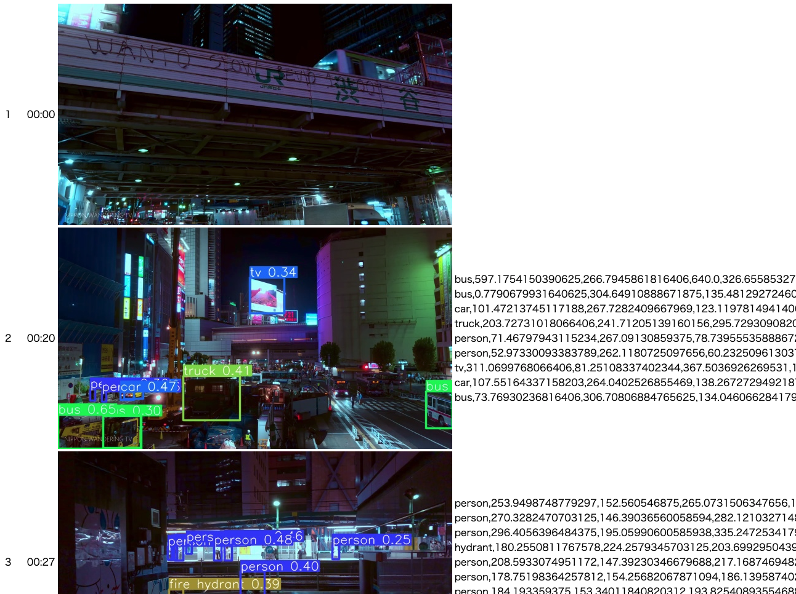

# Video-Yolo

## 概要

Youtube やローカルに保存されたの動画に対して YOLO による物体検出を行うプログラムである。
YOLO により検出された物体は、その領域を切り抜いて画像として保存され、さらに exel で確認できる。

## 利用方法

### 環境構築

以下のどちらかの環境が用意されている必要がある。

- Docker
- Python（3.8 以上）

#### 1. 環境構築

本プロジェクトは、Docker または Python による環境構築のどちらかで環境を構築することができる。

#### 1-A. Docker による環境構築

Docker を用いて環境構築を行う場合は、以下のコマンドを実行する。

```sh:
make run
```

コンテナ上で実行した場合は、処理結果は`./result`に出力される。コンテナの起動後、cli で実行する場合は以下のコマンドでコンテナにログインし、各種処理を行う。cli で実行する場合の詳細は、「cli で処理を実行する場合」の節を参照。

```sh:
make in
```

api 経由で実行する場合は、「API 経由で実行する場合 API 経由で実行する場合」の節を参照。

#### 2-B. Python による環境構築

ローカルに Python 環境が存在する場合は、以下のコマンドで依存ライブラリをインストールする。

```sh:
pip install -r requiremente.txt
```

### 実行

#### cli で処理を実行する場合

python cli を利用して処理を実行する場合は、以下のコマンドを用いる。処理結果は`./results/analytics/`以下に保存される。

```sh:
python main.py https://www.youtube.com/watch?v=V1KOF6epx1Q \ # 処理を行うYoutubeの動画のパス
                --scene_detector numeric \ # numericを指定した場合は、MAEなどで直前のシーンと比較し、画面が大きくくり変わった時に処理を行う。
                --numeric_threshold 40 \ # シーン検出を行う場合の閾値
                --save_path sample
```

`results/analytics/sample/index.html`を閲覧することで、検出結果を確認できる。



また、`results/analytics/${--save_pathで指定したフォルダ}/`以下に各フォルダが作成され、検出結果が保存される。

- `result.xlsx`: 実行結果を xlsx にしたもの。
- `cliped`: 検出箇所を切り抜いた画像。各クラスごとにフォルダが作成され、保存される。
- `param`: 各画像の検出領域とそのクラスである確率。
- `img`: 処理が行われたシーンの元画像。
- `material`: 検出箇所とクラスを描画した画像。このフォルダ内の画像が`index.html`から参照されている。

実行コマンドのコマンドの詳細なオプションは下記の通り。

```sh:
python main.py -h
usage: main.py [-h] [--save_path SAVE_PATH] [--scene_detector SCENEDCT] [--target_image_path TARGET_IMAGE_PATH] [--face_threshold FACE_threshold] [--calc_method CALC_METHOD]
               [--numeric_threshold NUMERIC_threshold]
               url

positional arguments:
  url                   処理を行う動画のURL。ローカルその動画へのパスを指定する。

optional arguments:
  -h, --help            show this help message and exit
  --save_path SAVE_PATH
                        ダウンロードした動画や検出結果を保存するディレクトリへのパス
  --scene_detector SCENEDCT   シーンをカットする方法(face: --target_image_pathで指定した顔画像が出現した場合。, numeric: 直前のフレームとの差分)
  --target_image_path TARGET_IMAGE_PATH
                        scene_detector=faceの時、検出対象の顔画像のパス
  --face_threshold FACE_threshold
                        scene_detector=faceの時、シーンをカットする変数の閾値
  --calc_method CALC_METHOD
                        scene_detector=numericの時、シーンをカットするメソッド(MAE, MSE, MAE_HSV, MAE_block)
  --numeric_threshold NUMERIC_threshold
                        scene_detector=numericの時、シーンをカットする変数の閾値
```

#### API 経由で実行する場合 API 経由で実行する場合

API 経由で実行する場合外部から処理を実行することができる。API サーバを実行する場合、以下のコマンドを用いる。

```sh
python api.py
```

`localhost:3000`に対してリクエストを送ることで、API 経由で処理を実行することができる。

| メソッド | パス                            | 概要                                                        |
| -------- | ------------------------------- | ----------------------------------------------------------- |
| GET      | `localhost:3000/download/video` | 動画をダウンロードする。                                    |
| GET      | `localhost:3000/download/audio` | 動画から音声情報のみを抽出しダウンロードする。              |
| POST     | `localhost:3000/analytics`       | URL で指定した動画に対して、YOLO による物体検出処理を行う。 |

各 API の詳細に関しては、`test`フォルダに [Postman](https://www.postman.com/) のサンプルがあるので、そちらを参照。
